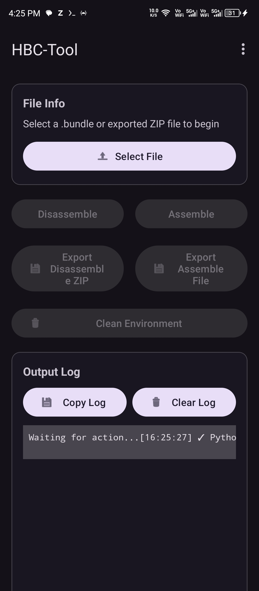
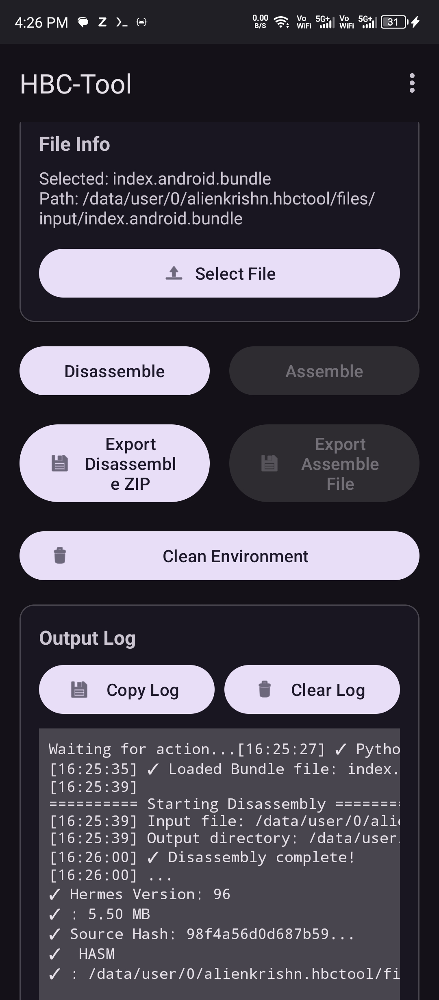

# HBCToolApp

> Disassemble & assemble Hermes Bytecode (`.bundle`) right from your Android device.

---

## Download

[!NOTE]
Download the latest version directly from GitHub Releases:  
**[⬇️ Get HBCToolApp](https://github.com/Anon4You/HBCToolApp/releases)**

---

## Capabilities

- **Disassemble:** Convert `.bundle` files into readable `.hasm` assembly + JSON metadata
- **Assemble:** Rebuild working `.bundle` files from `.hasm` and JSON sources
- **Import/Export:** Seamlessly handle disassembly folders via ZIP archives
- **Clean Environment:** One-tap wipe of all internal temporary files
- **Live Logging:** Real-time timestamped output with copy-to-clipboard
- **Modern UI:** Edge-to-edge design with dynamic dark/light theming

---

## Requirements

[!NOTE]
- **Android 8.0+** (API 24 or higher)
- **64-bit ARM device** (arm64-v8a) — Python 3.13 does not support 32-bit ARM

---

## Screenshots

<table>
  <tr>
    <td></td>
    <td></td>
  </tr>
</table>

---

## Usage

1. **Select** – Tap *Select File* and choose a `.bundle`, `.hasm`, or `.zip` from your device.
2. **Disassemble** – Load a `.bundle` and tap *Disassemble* to extract the `.hasm` and JSON files.
3. **Assemble** – Load a folder (via ZIP import or picker) containing `metadata.json`, `string.json`, and `instruction.hasm`, then tap *Assemble*.
4. **Export** – Use *Export ZIP* for disassembly outputs, or *Export Bundle* for the assembled `.bundle`.
5. **Clean** – Tap to instantly delete all files stored in the app's internal `input/` and `output/` directories.

---

[!NOTE]
**Credits:** Original [HBC-Tool](https://github.com/Kirlif/HBC-Tool) by Kirlif • Python integration via [Chaquopy](https://chaquo.com/chaquopy/) • Built with Kotlin & ❤️  
**License:** [MIT](LICENSE)